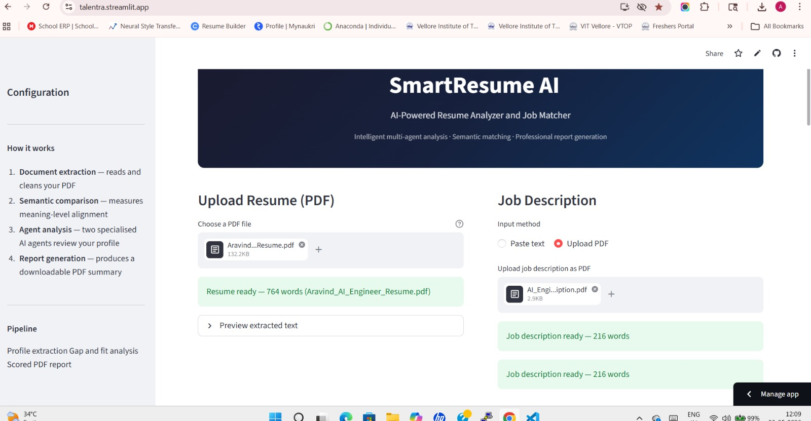
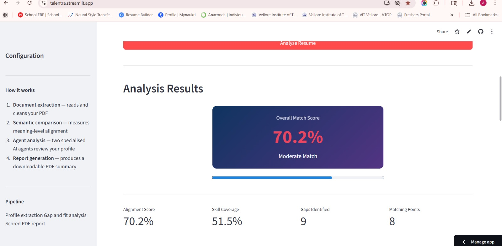
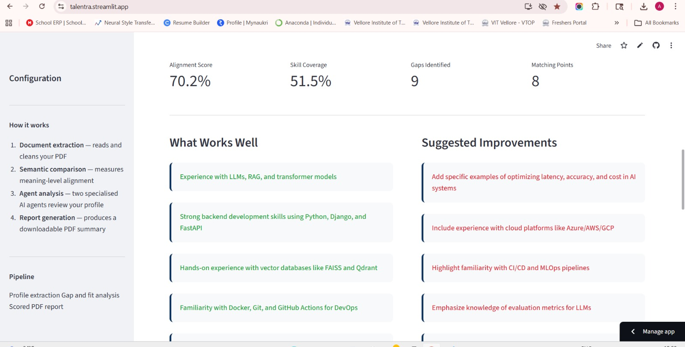
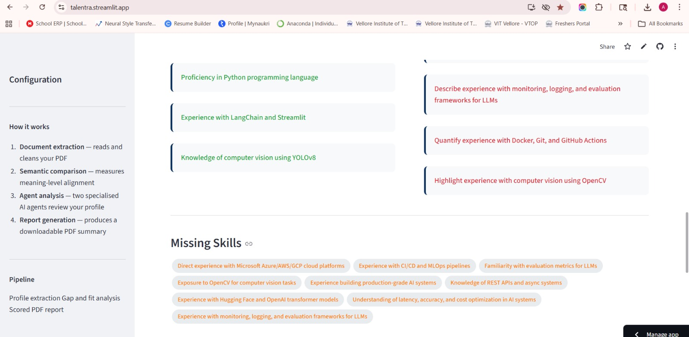
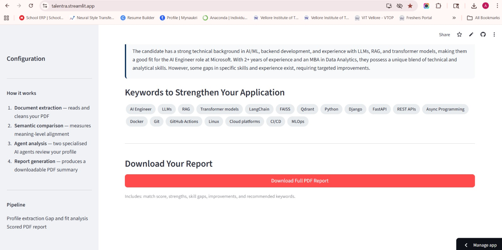
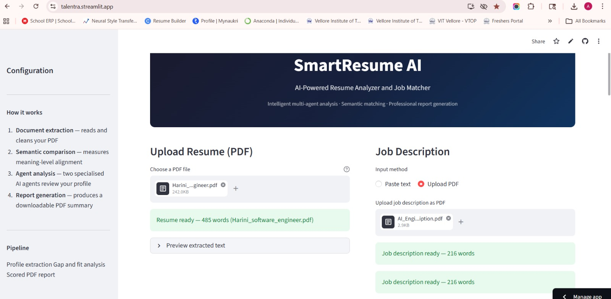
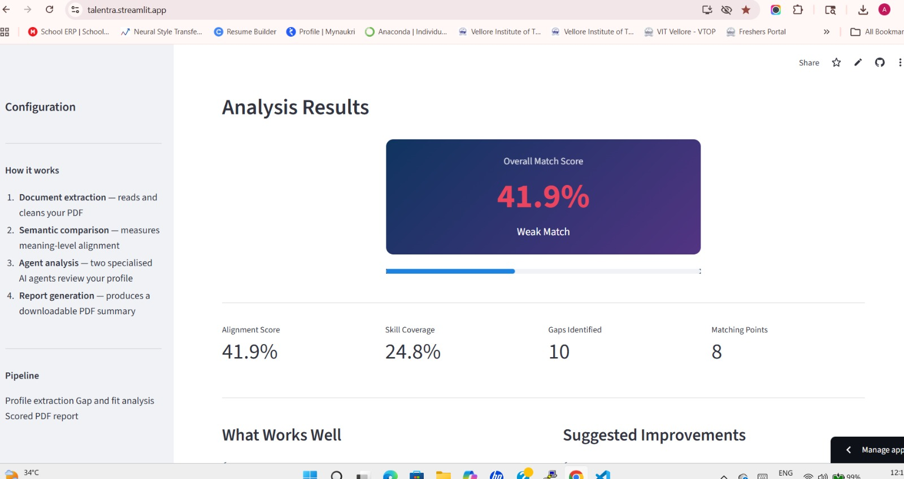
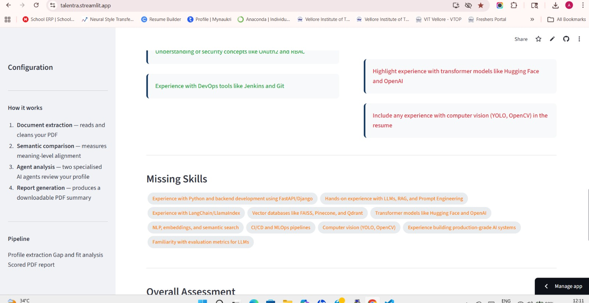
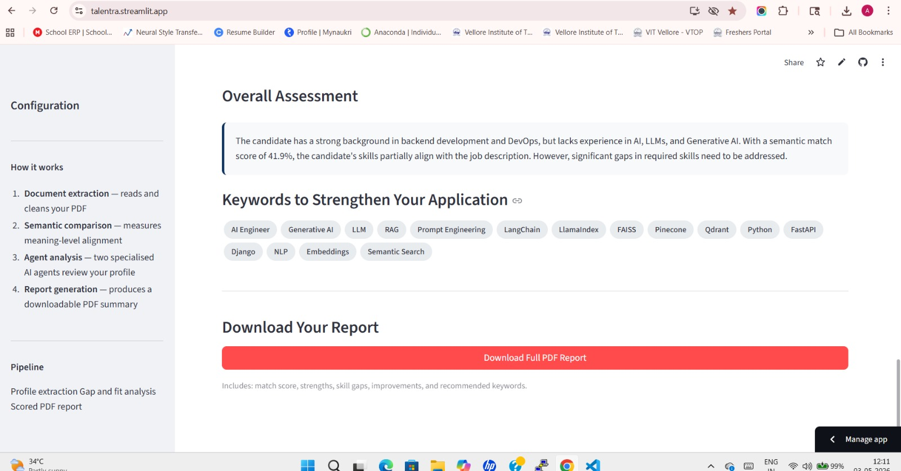

# SmartResume AI – Resume Analyzer & Job Matcher

> **AI Developer Intern Assignment** – Daivtech Solutions Pvt Ltd  
> Developed using open-source technologies, leveraging Groq LLaMA-3.3-70B and CrewAI for agentic AI orchestration

---

## Live Demo

> Deployment link 
**App**  
[Open SmartResume AI](https://talentra.streamlit.app/)

**Demo Videos**  
[Watch Demo 1](https://drive.google.com/file/d/1YMe3dQ2UNHLHNlvxhEdeGjRKxMF1hBvH/view?usp=sharing)  
[Watch Demo 2](https://drive.google.com/file/d/1yvdV8uP_1M3XAHQwE0tv4K4jZPqujsPm/view?usp=sharing)

**Screenshots**










---

## What It Does

SmartResume AI is an intelligent resume evaluation tool that:

1. **Parses** a candidate's PDF resume using **PyMuPDF**
2. **Accepts** a job description (pasted text or PDF upload)
3. **Computes semantic similarity** using **sentence-transformers** (`all-MiniLM-L6-v2`) running fully locally
4. **Performs deep AI analysis** via **Groq Model** with **`llama-3.3-70b-versatile`**
5. **Generates** a branded, downloadable **PDF report** using **ReportLab**

### Analysis Output Includes
- Overall **match score** (semantic + keyword weighted)
- **Strengths** – what aligns well with the JD
- **Missing skills / Skill gaps**
- **Actionable improvement suggestions**
- **ATS keywords** to add to the resume
- Experience match, education match, hiring recommendation

---

## Architecture

smartresume_ai/
├── app.py                    
├── modules/
│   ├── __init__.py
│   ├── pdf_parser.py         
│   ├── embeddings.py          
│   ├── llm_analyzer.py       
│   ├── report_generator.py    
│   ├── validators.py          
│   └── utils.py                
├── requirements.txt
└── README.md

### Tech Stack

| Component | Library |
|-----------|---------|
| PDF Parsing | **PyMuPDF** (fitz) |
| Semantic Embeddings | **sentence-transformers** - all-MiniLM-L6-v2 |
| Local NLP | Runs **100% locally** – no external API for embeddings |
| LLM Analysis | **Groq API** – `llama-3.3-70b-versatile` |
| Report Generation | **ReportLab** |
| UI | **Streamlit** |

---

##  Setup & Installation

### 1. Clone the Repository

### 2. Install Dependencies

pip install -r requirements.txt

> **Note:** sentence-transformers will download the all-MiniLM-L6-v2 model (~80 MB) on first run. This is cached locally for all subsequent runs.

### 3. Get a Groq API Key

1. Visit [console.groq.com](https://console.groq.com)
2. Create a free account and generate an API key
3. Either:
   - Paste it in the Streamlit sidebar at runtime, **or**
   - Create a .env file: GROQ_API_KEY=gsk_your_key_here

### 4. Run the App

streamlit run app.py

Open [http://localhost:8501] in your browser.

---

## Test Scenarios Covered

### Functional Scenarios
- Valid PDF resume + pasted/uploaded JD → full analysis + PDF report
- High match score (>75%) → green score card
- Moderate match (50–75%) → yellow score card
- Low match (<50%) → red score card

### Edge Cases
| Scenario | Handling |
|----------|----------|
| Resume with only name & contact | ValidationError → friendly message |
| JD too short / vague (< 20 words) | ValidationError → user prompt |
| Very long resume (10+ pages) | Page cap (60 pages), graceful truncation |
| Extremely short resume (< 30 words) | Rejected with clear explanation |
| 10+ page resume | Processed, word count shown |

### Negative / Error Scenarios
| Scenario | Handling |
|----------|----------|
| Corrupted PDF | PDFParseError → clear error box in UI |
| Password-protected PDF | PDFParseErro` → asks for unencrypted version |
| Scanned (image-only) PDF | PDFParseError → suggests OCR |
| Non-English document | PDFParseError → language error message |
| No file uploaded | Button disabled; input validation prevents crash |
| Invalid Groq API key | ValueError → instructional error message |
| Groq API rate limit | Auto-retry with exponential backoff (3 attempts) |
| Groq API timeout | TimeoutError → retry suggestion |
| Network interruption | Retry mechanism; clear error with retry button |
| LLM returns malformed JSON | Regex fallback parser → safe default response |
| Duplicate submission (same inputs) | Hash comparison → skips re-analysis, shows cached result |

### Network Scenarios
- High-speed (Wi-Fi / 5G): Full flow works normally
- Slow network (2G): Groq API calls may be slow; progress bar remains visible
- Network interruption: ConnectionError caught → "Check your connection" message
- Wi-Fi → Mobile Data switch: Retry on next button click (stateless HTTP)
- After network failure: Retry mechanism in llm_analyzer.p` (3 attempts, exponential backoff)

---

## Evaluation Metrics

| Metric | Description |
|--------|-------------|
| **Semantic Match Score** | Cosine similarity between resume + JD sentence embeddings (70% weight) |
| **Keyword Overlap** | Jaccard-style skill keyword coverage of JD skills (30% weight) |
| **Combined Score** | Weighted blend: 0.7 × semantic + 0.3 × keyword |
| **LLM Verdict** | experience_match, education_match, hiring_recommendation |

### Design Rationale
- **Why sentence-transformers?** Unlike TF-IDF or plain keyword matching, semantic embeddings capture meaning (e.g. "ML Engineer" ≈ "Machine Learning Developer"), leading to more accurate match scores.
- **Why weighted blend?** Pure semantic similarity can over-score on tone/style; keyword overlap ensures exact skill matching is rewarded.
- **Why Groq + LLaMA-3.3-70B?** 70B parameter reasoning model produces nuanced, high-quality analysis. Groq's inference speed (~330 tokens/s) makes it practical for a web UI.

---

## Sample Input / Output

### Sample Input
- **Resume**: A Python developer's resume with FastAPI, Docker, PostgreSQL experience
- **Job Description**: Senior Python Developer role requiring AWS, Kubernetes, FastAPI, CI/CD

### Sample Output
```
Match Score: 67.3% (Moderate Match)
Skill Overlap: 58.2%

Strengths:
Strong FastAPI and REST API development experience
PostgreSQL database design and optimisation

Missing Skills:
AWS / cloud infrastructure experience
Kubernetes container orchestration
CI/CD pipeline implementation

Improvements:
Add a 'Cloud & Infrastructure' section highlighting any AWS/GCP projects
Include containerisation experience (Docker Compose → Kubernetes migration path)
```

---
